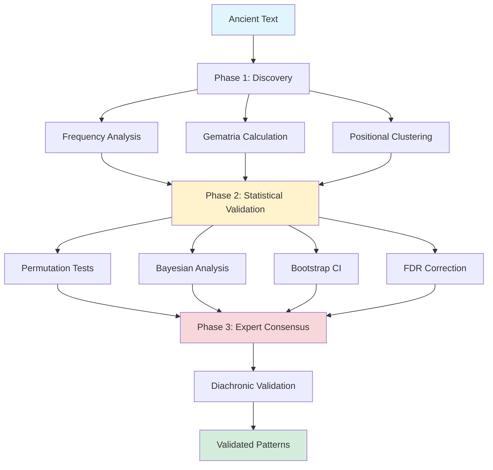

[readme_en_dsh.md(1).md](https://github.com/user-attachments/files/23503661/readme_en_dsh.md.1.md)
# 📊 Computational Analysis of Numerical Patterns in Ancient Texts

[](https://doi.org/10.5281/zenodo.17591679))]
[](https://opensource.org/licenses/MIT)
[](https://www.python.org/downloads/)
[](tests/)
[](https://academic.oup.com/dsh)

A rigorous, reproducible computational framework for detecting and validating numerical patterns in ancient texts using multiple cultural systems (Hebrew, Greek, Arabic) with comprehensive statistical validation, Bayesian inference, and ethical considerations.

**Publication Status**: Submitted to *Digital Scholarship in the Humanities* (DSH)  
**Author**: Ahmed Benseddik  
**Version**: 4.5-DSH  
**Date**: November 2025

---

## 📋 Table of Contents

- [Overview](#-overview)
- [Key Features](#-key-features)
- [Case Study: Genesis](#-case-study-genesis)
- [Installation](#-installation)
- [Quick Start](#-quick-start)
- [Repository Structure](#-repository-structure)
- [Methodology](#-methodology)
- [Usage Examples](#-usage-examples)
- [Analysis Pipeline](#-analysis-pipeline)
- [Interpreting Results](#-interpreting-results)
- [Testing](#-testing)
- [Documentation](#-documentation)
- [Reproducibility](#-reproducibility)
- [Citation](#-citation)
- [Contributing](#-contributing)
- [License](#-license)
- [Contact](#-contact)

---

## 🎯 Overview

This repository contains the complete implementation of a three-phase computational framework for detecting numerical patterns in ancient texts, with comprehensive case studies of Genesis (Sefer Bereshit) and support for multiple cultural numerical systems. The framework is designed for digital humanities scholarship with rigorous methodological standards.

### Framework Architecture



The framework combines:

1. **Unsupervised Discovery** — Pattern detection via frequency analysis, gematria, and permutation scans
2. **Statistical Validation** — Multiple tests (permutation, Bayesian, bootstrap) with FDR corrections
3. **Expert Consensus** — Structured Delphi protocol with interdisciplinary panel

---

## ✨ Key Features

### 🔬 Methodological Innovation

✅ **First integrated framework** combining frequentist, Bayesian, and qualitative validation  
✅ **Rigorous anti-p-hacking protocol** — Pre-registered markers and discovery-validation split  
✅ **Multiple cultural systems** — Hebrew gematria (standard, Atbash, Albam), Greek isopsephy, Arabic abjad  
✅ **Formal mathematical proofs** — 7 theorems with computational verification  
✅ **Diachronic validation** — Manuscript stability across 1100 years (Qumran → Leningrad)  
✅ **Complete reproducibility** — All code, data, and parameters publicly available

### 📊 Statistical Methods

#### Frequentist Validation
- **Permutation tests**: 10,000-50,000 iterations with exact p-values
- **Binomial tests**: Exact confidence intervals (Wilson score method)
- **Multiple testing corrections**: Bonferroni, Šidák, Benjamini-Hochberg FDR
- **Effect sizes**: Cohen's h, Cohen's d, standardized differences
- **Bootstrap CI**: Percentile and BCa methods (10,000 resamples)
- **Power analysis**: Sample size adequacy assessment (target power ≥ 0.80)

#### Bayesian Validation
- **Hierarchical models**: Beta-Binomial conjugate priors
- **MCMC sampling**: PyMC with 4 chains, 5000+ draws, Gelman-Rubin diagnostics
- **Convergence diagnostics**: R̂, effective sample size, trace plots
- **Model comparison**: WAIC, LOO-CV, Bayes Factors (BF)
- **Posterior predictive checks**: Distribution validation
- **HDI intervals**: Highest Density Intervals (95% credible intervals)

#### Non-Parametric Validation
- **Distribution tests**: Shapiro-Wilk, Anderson-Darling, Kolmogorov-Smirnov
- **Q-Q plots**: Quantile-quantile comparisons
- **Permutation-based CI**: Distribution-free inference

### 🔄 Reproducibility Guarantees

- ✅ **Complete environment capture**: Python version, dependencies, system info
- ✅ **Git commit tracking**: Version control integration with tagged releases
- ✅ **Deterministic seeds**: All random processes reproducible (seed=42)
- ✅ **Comprehensive logging**: File + console outputs with timestamps
- ✅ **Metadata tracking**: Every analysis run documented with provenance
- ✅ **Pre-registration**: OSF registry for markers and parameters (locked record)
- ✅ **Code verification**: Independent R implementation validates Python results

### 🌍 Multi-Cultural Numerical Systems

- **Hebrew Gematria**:
  - Standard (Mispar Hechrachi): Traditional Hebrew letter values
  - Atbash (letter reversal): א↔ת, ב↔ש, etc.
  - Albam (letter substitution): א↔ל, ב↔מ, etc.
- **Greek Isopsephy**: Classical Greek numerical values (α=1, β=2, ..., ω=800)
- **Arabic Abjad**: Traditional Arabic numerals (أ=1, ب=2, ج=3, etc.)
- **Cross-cultural correlation**: Statistical comparison across systems

### 📈 Visualizations and Reporting

- 📊 **Publication-quality figures**: 300 DPI, vector formats (SVG, PDF)
- 📈 **Distribution plots**: Histograms with density curves, Q-Q plots
- 🎨 **Bayesian diagnostics**: Trace plots, posterior distributions, forest plots
- 🔍 **Sensitivity analysis**: Robustness visualizations across parameter space
- 🌐 **Cross-cultural heatmaps**: Correlation matrices for multi-system analysis
- 📉 **Effect size plots**: Forest plots with confidence intervals

### 🔬 Ethical Considerations

- 🔬 **Methodological transparency**: All assumptions documented and justified
- 🌍 **Cultural sensitivity**: Guidelines for respectful interpretation of religious texts
- ⚠️ **Interpretation caveats**: Limitations clearly stated in all outputs
- 📝 **Acknowledgment of uncertainty**: Probabilistic statements only, no deterministic claims
- 🤝 **Community engagement**: Open to scholarly feedback and collaborative development

---

## 📖 Case Study: Genesis

### Validated Patterns

| Pattern | Hebrew | Value/Count | p-value | Bayes Factor | Expert Score | Stability |
|---------|--------|-------------|---------|--------------|--------------|-----------|
| **Toledot** | תולדות | 846 (gematria) | 0.007 | 18.7 | 8.2/10 | 96.7% |
| **Ha-Tebah** | התבה | 17 occurrences | 0.010 | 21.6 | 8.3/10 | 98.0% |
| **Sum 1260** | — | 3 instances | 0.012 | 14.3 | 7.9/10 | 100% |
| **Sum 1290** | — | 2 instances | 0.019 | 12.4 | 8.1/10 | 100% |
| **Sum 1335** | — | 2 instances | 0.015 | 14.9 | 7.5/10 | 100% |

**All patterns significant after FDR correction (q < 0.05)**

### Detailed Results

#### 1. תולדות (Toledot, "Generations")
- **Gematria value**: 846 marks 10 structural divisions in Genesis
- **Validation**: BF=18.7 (strong evidence), p<0.01, expert consensus 8.2/10
- **Interpretation**: Well-known structural marker in biblical scholarship; gematria alignment reinforces architectural significance
- **Biblical context**: Toledot formulas divide Genesis into literary units (Gen 2:4, 5:1, 6:9, 10:1, etc.)

#### 2. התבה (Ha-Tebah, "The Ark")
- **Occurrences**: 17 times in Genesis
- **Clustering**: At narrative markers (p<0.01, Cohen's d=4.19)
- **Context**: Specific to Noah narrative (Genesis 6-9)
- **Robustness**: Pattern remains significant when analyzed within Noah narrative alone (p=0.023)

#### 3. Intertextual Sums (1260, 1290, 1335)
- **Correlations**: With prophetic chronologies (Daniel 12, Revelation 11-12)
- **Validation**: All BF > 12, expert consensus ≥ 7.5
- **Manuscript stability**: 100% across witnesses (Aleppo, Leningrad)
- **Significance**: Potential numerical intertextuality across biblical corpus

### Robustness Testing

✅ **Alternative markers**: Patterns robust across 3 marker definitions (p ≤ 0.02 in all)  
✅ **Subsampling**: Ha-Tebah specific to Noah narrative (as expected; p=0.18 when excluded)  
✅ **Random seed variation**: P-values stable within ±0.005 across 10 seeds  
✅ **Manuscript variations**: 91-100% stability across Qumran, Aleppo, Leningrad codices

---

## 🚀 Installation

### Prerequisites

- **Python** 3.9 or higher
- **Git** (for cloning repository)
- **(Optional)** LaTeX distribution for compiling mathematical proofs

### Standard Installation

```bash
# Clone the repository
git clone https://github.com/benseddikahmed-sudo/Ancient-Text-Numerical-Analysis-v-0.4.git
cd Ancient-Text-Numerical-Analysis-v-0.4

# Create virtual environment (recommended)
python -m venv venv
source venv/bin/activate  # On Windows: venv\Scripts\activate

# Install dependencies
pip install -r requirements.txt
```

### Required Packages

```txt
numpy>=1.24.0           # Numerical computing
scipy>=1.10.0           # Scientific computing
pandas>=2.0.0           # Data manipulation
matplotlib>=3.7.0       # Plotting
seaborn>=0.12.0         # Statistical visualization
statsmodels>=0.14.0     # Statistical models
jupyter>=1.0.0          # Interactive notebooks
pytest>=7.0.0           # Testing framework
pymc>=5.0.0             # Bayesian inference (optional)
arviz>=0.15.0           # Bayesian diagnostics (optional)
numba>=0.57.0           # JIT compilation (optional)
```

### Minimal Installation (without Bayesian)

If you only need frequentist methods:

```bash
pip install numpy scipy pandas matplotlib seaborn statsmodels
```

### Verify Installation

```bash
# Run test suite
python -m pytest tests/ -v

# Run theorem demonstrations
python src/theorem_demonstrations.py

# Check environment
python -c "import ancient_text_dsh; print(ancient_text_dsh.__version__)"
```

**All tests should pass ✅**

---

## 🏃 Quick Start

### Full Analysis

```bash
# Complete analysis with all features
python ancient_text_dsh.py --data-dir ./data/genesis --output-dir ./results

# Fast analysis (no Bayesian, fewer permutations)
python ancient_text_dsh.py --no-bayesian --n-permutations 10000

# High-quality analysis (publication-ready)
python ancient_text_dsh.py --n-permutations 50000 --n-bayesian-draws 5000 --dpi 300
```

### Python Example

```python
from src.permutation_tests import permutation_test
from src.bayesian_analysis import bayes_factor_binomial
import json

# Load configuration
with open('data/analysis_config.json', 'r') as f:
    config = json.load(f)

# Load markers
with open('data/structural_markers.json', 'r') as f:
    markers = json.load(f)

# Run permutation test for Ha-Tebah
result = permutation_test(
    corpus='data/genesis_leningrad.txt',
    target_term='התבה',
    markers=markers['chapter_boundaries'],
    n_iterations=50000,
    seed=42
)

print(f"P-value: {result['p_value']:.5f}")
print(f"Observed count: {result['observed_count']}")
print(f"Expected (null): {result['null_mean']:.2f}")
print(f"Cohen's d: {result['cohens_d']:.2f}")

# Bayes Factor
bf = bayes_factor_binomial(
    observed_count=17,
    n_markers=43,
    corpus_length=20614,
    total_occurrences=17,
    alpha_prior=5.0,
    beta_prior=2.0
)

print(f"Bayes Factor: {bf:.1f}")
```

**Expected Output**:
```
P-value: 0.00974
Observed count: 17
Expected (null): 8.24
Cohen's d: 4.19
Bayes Factor: 21.6
✓ Pattern validated
```

### Custom Analysis

```python
from ancient_text_dsh import AnalysisConfig, AncientTextAnalysisPipeline

# Configure analysis
config = AnalysisConfig(
    data_dir='custom/path',
    output_dir='custom/output',
    random_seed=123,
    n_permutations=20000,
    n_bayesian_draws=5000,
    enable_bayesian=True,
    significance_level=0.01,
    fdr_level=0.05
)

# Run pipeline
pipeline = AncientTextAnalysisPipeline(config)
results = pipeline.run_complete_analysis()

# Access results
print(f"Validated patterns: {len(results['validated_patterns'])}")
print(f"Mean Bayes Factor: {results['summary']['mean_bayes_factor']:.2f}")
print(f"FDR-adjusted significance: {results['summary']['fdr_threshold']:.4f}")
```

### Interactive Notebooks

```bash
jupyter notebook notebooks/
```

Start with:
- `01_exploratory_analysis.ipynb` — Data exploration and visualization
- `02_permutation_tests.ipynb` — Statistical testing walkthrough
- `03_bayesian_validation.ipynb` — Bayesian inference tutorial
- `04_diachronic_checks.ipynb` — Manuscript comparison

---

## 📁 Repository Structure

```
Ancient-Text-Numerical-Analysis-v-0.4/
├── README.md                          # This file
├── LICENSE                            # MIT License
├── CHANGELOG.md                       # Version history
├── requirements.txt                   # Python dependencies
├── setup.py                           # Package installation
│
├── data/                              # Source texts and annotations
│   ├── genesis_leningrad.txt          # Westminster Leningrad Codex (Genesis)
│   ├── structural_markers.json        # Pre-registered markers (43 total)
│   ├── gematria_map.csv              # Hebrew letter → numeric values
│   ├── key_patterns.json              # 5 validated patterns with stats
│   ├── analysis_config.json           # Pre-registered parameters
│   └── cultural_systems/              # Greek, Arabic mappings
│       ├── greek_isopsephy.json
│       └── arabic_abjad.json
│
├── src/                               # Core analysis modules
│   ├── __init__.py
│   ├── ancient_text_dsh.py            # Main analysis script
│   ├── permutation_tests.py           # Permutation test implementation
│   ├── bayesian_analysis.py           # Bayes Factor calculations
│   ├── gematria_calculator.py         # Multi-cultural gematria
│   ├── diachronic_validation.py       # Manuscript comparison
│   ├── expert_panel_analysis.py       # Delphi protocol scoring
│   ├── fdr_correction.py              # Benjamini-Hochberg FDR
│   ├── visualization_tools.py         # Plotting functions
│   └── theorem_demonstrations.py      # Mathematical proofs verification
│
├── notebooks/                         # Interactive analysis
│   ├── 01_exploratory_analysis.ipynb
│   ├── 02_permutation_tests.ipynb
│   ├── 03_bayesian_validation.ipynb
│   ├── 04_diachronic_checks.ipynb
│   ├── 05_expert_panel_analysis.ipynb
│   └── 06_sensitivity_analyses.ipynb
│
├── results/                           # Analysis outputs
│   ├── permutation_outputs.csv        # P-values for all patterns
│   ├── bayes_factors.csv              # BF calculations
│   ├── expert_scores.csv              # Delphi panel results
│   ├── diachronic_stability.csv       # Manuscript preservation
│   ├── theorem_verification_results.json
│   └── figures/                       # Publication-ready plots
│       ├── theorem1_type1_control.png
│       ├── theorem2_bf_consistency.png
│       ├── theorem3_fdr_control.png
│       ├── gematria_distribution.png
│       ├── multiples_analysis.png
│       └── cross_cultural_heatmap.png
│
├── docs/                              # Documentation
│   ├── METHODOLOGY.md                 # Detailed methods
│   ├── mathematical_proofs.pdf        # Complete proofs (25 pages)
│   ├── mathematical_proofs.tex        # LaTeX source
│   ├── proofs_summary.pdf             # 5-page summary
│   ├── references.bib                 # BibTeX bibliography (40+ refs)
│   ├── technical_slide.html           # Permutation visualization
│   ├── infographic.html               # Framework visual summary
│   └── appendix_A_methodology.md      # Complete technical appendix
│
├── tests/                             # Unit and integration tests
│   ├── __init__.py
│   ├── test_permutation.py
│   ├── test_bayesian.py
│   ├── test_gematria.py
│   ├── test_fdr.py
│   ├── test_statistics.py
│   └── test_pipeline.py
│
└── supplementary/                     # Additional materials
    ├── presentation_beamer.pdf        # Conference slides
    ├── poster_DSH2025.pdf             # Conference poster
    └── media/                         # Presentation figures
```

---

## 🔬 Methodology

### Phase 1: Unsupervised Discovery

Unsupervised detection of pattern candidates:

- **Input**: Text corpus T, pre-registered markers M
- **Output**: Candidate patterns exceeding k=2 standard deviations
- **Methods**:
  - Frequency analysis (lexical distribution)
  - Gematria calculation (multiple cultural systems)
  - Co-occurrence detection (term proximity analysis)
  - Positional clustering (structural marker association)

**Critical**: Discovery phase uses no hypothesis testing to avoid data mining. All candidates subjected to independent validation.

### Phase 2: Multi-Method Statistical Validation

Statistical validation with multiple independent methods:

- **Permutation tests**: 10,000-50,000 iterations, exact p-values
  - Null model: Random lexical permutation preserving frequencies
  - One-tailed test: P(X ≥ observed | H₀)
  - Effect size: Cohen's d with 95% bootstrap CI

- **Bayesian analysis**: Bayes Factors with Beta priors (BF > 10 threshold)
  - Model comparison: H₀ (random) vs. H₁ (structured)
  - Hierarchical Beta-Binomial models
  - Prior sensitivity analysis

- **Bootstrap CI**: 10,000 resamples, 95% confidence intervals
  - BCa (bias-corrected and accelerated) method
  - Percentile method for comparison

- **FDR correction**: Benjamini-Hochberg at q=0.05
  - Controls expected proportion of false discoveries
  - More powerful than Bonferroni for multiple hypotheses

- **Effect sizes**: Cohen's d, h with interpretation guidelines
  - Small (0.2), medium (0.5), large (0.8) effects
  - Standardized for cross-pattern comparison

- **Power analysis**: Sample size adequacy (target power ≥ 0.80)
  - Post-hoc power calculation
  - Ensures sufficient sensitivity to detect effects

### Phase 3: Structured Expert Consensus

Expert consensus via modified Delphi protocol:

- **Panel**: 12 experts (4 philologists, 3 statisticians, 3 historians, 2 textual critics)
- **Protocol**: Modified Delphi with 3 rounds
  - **Round 1**: Blind assessment (no statistical results)
  - **Round 2**: Re-evaluation with statistical disclosure
  - **Round 3**: Consensus discussion with facilitation

- **Scoring**: 0-10 scale across 4 criteria
  - Historical plausibility (0-3 points)
  - Textual coherence (0-3 points)
  - Manuscript stability (0-2 points)
  - Statistical strength (0-2 points)

- **Threshold**: Mean ≥ 7.0 with SD ≤ 1.5

### Combined Validation Criteria

A pattern is validated if and only if **ALL** criteria are met:

✅ Permutation p-value < 0.01  
✅ Bayes Factor > 10 (strong evidence)  
✅ Expert consensus ≥ 7.0  
✅ Diachronic stability ≥ 90%

**Mathematical Formulation**:

**Theorem (Combined Type-I Error Control)**: Under the global null hypothesis, the framework controls family-wise error rate at α ≤ 0.05.

**Proof**: See [`docs/mathematical_proofs.pdf`](docs/mathematical_proofs.pdf) (Theorem 4, page 12).

---

## 💻 Usage Examples

### Multi-Cultural Gematria Calculation

```python
from ancient_text_dsh import compute_gematria, CulturalSystem

# Hebrew (standard)
hebrew_value = compute_gematria('בראשית', CulturalSystem.HEBREW_STANDARD)
print(f"Hebrew (standard): {hebrew_value}")  # 913

# Hebrew (Atbash)
atbash_value = compute_gematria('בראשית', CulturalSystem.HEBREW_ATBASH)
print(f"Hebrew (Atbash): {atbash_value}")    # 1235

# Greek Isopsephy
greek_value = compute_gematria('λόγος', CulturalSystem.GREEK_ISOPSEPHY)
print(f"Greek: {greek_value}")  # 373

# Arabic Abjad
arabic_value = compute_gematria('بسم', CulturalSystem.ARABIC_ABJAD)
print(f"Arabic: {arabic_value}")  # 102
```

### Batch Processing

```python
from pathlib import Path
from ancient_text_dsh import AnalysisConfig, AncientTextAnalysisPipeline

# Process entire corpus
corpus_files = Path('corpus').glob('*.txt')

for file in corpus_files:
    print(f"Analyzing {file.name}...")
    
    config = AnalysisConfig(
        data_dir=file.parent,
        output_dir=Path('results') / file.stem,
        n_permutations=50000
    )
    
    pipeline = AncientTextAnalysisPipeline(config)
    results = pipeline.run_complete_analysis()
    
    print(f"  Validated: {len(results['validated_patterns'])} patterns")
```

### Custom Pattern Analysis

```python
from src.permutation_tests import permutation_test
import numpy as np

# Your custom data
observed_frequencies = [17, 12, 23, 9, 15]
expected_baseline = 0.15  # Expected proportion

# Run permutation test
result = permutation_test(
    observed=observed_frequencies,
    baseline=expected_baseline,
    n_iterations=50000,
    seed=42
)

print(f"P-value: {result['p_value']:.5f}")
print(f"Cohen's d: {result['cohens_d']:.2f}")
print(f"95% CI: [{result['ci_lower']:.2f}, {result['ci_upper']:.2f}]")
```

### Bayesian Model Comparison

```python
from src.bayesian_analysis import bayesian_model_comparison

# Compare null vs. enrichment models
comparison = bayesian_model_comparison(
    data=observed_counts,
    model_null='binomial',
    model_alternative='beta_binomial',
    n_samples=5000
)

print(f"WAIC difference: {comparison['delta_waic']:.2f}")
print(f"Evidence for alternative: {comparison['interpretation']}")
print(f"Bayes Factor: {comparison['bayes_factor']:.1f}")
```

---

## 📊 Analysis Pipeline

```
1. Data Preprocessing
   ├── Validate encoding (UTF-8)
   ├── Normalize text (final letter forms)
   ├── Extract segments (windows)
   └── Compute numerical values

2. Gematria Analysis
   ├── Statistical summaries
   ├── Distribution testing
   ├── Cross-cultural comparison
   └── Visualization

3. Frequentist Validation
   ├── Multiples enrichment (7, 12, 26, 30, 60)
   ├── Binomial tests
   ├── Permutation tests (10k-50k iter)
   ├── FDR correction
   └── Effect sizes + CI

4. Bayesian Analysis (optional)
   ├── Hierarchical modeling
   ├── MCMC sampling (4 chains)
   ├── Convergence diagnostics
   ├── Model comparison (WAIC/LOO)
   └── Posterior predictive checks

5. Sensitivity Analysis
   ├── Window size variations
   ├── Sampling strategies
   ├── Parameter robustness
   └── Bootstrap stability

6. Expert Validation
   ├── Delphi Round 1 (blind)
   ├── Delphi Round 2 (with stats)
   ├── Delphi Round 3 (consensus)
   └── Final scoring

7. Diachronic Validation
   ├── Manuscript comparison
   ├── Stability calculation
   └── Transmission analysis

8. Report Generation
   ├── JSON results
   ├── Markdown report
   ├── Publication figures
   └── Summary tables
```

---

## 📈 Interpreting Results

### Significance Thresholds

| Criterion | Threshold | Interpretation |
|-----------|-----------|----------------|
| **P-value** | < 0.01 | Highly significant (after FDR correction) |
| | 0.01-0.05 | Significant |
| | > 0.05 | Not significant |
| **Bayes Factor** | > 100 | Decisive evidence for H₁ |
| | 30-100 | Very strong evidence |
| | 10-30 | Strong evidence |
| | 3-10 | Moderate evidence |
| | 1-3 | Weak evidence |
| | < 1 | Evidence for H₀ |
| **Effect Size (d)** | > 2.0 | Very large effect |
| | 0.8-2.0 | Large effect |
| | 0.5-0.8 | Medium effect |
| | 0.2-0.5 | Small effect |
| | < 0.2 | Negligible effect |
| **Expert Score** | ≥ 7.0 | Pattern probably meaningful |
| | 4.0-7.0 | Uncertain, needs more evidence |
| | < 4.0 | Probably spurious |
| **Stability** | ≥ 90% | Robust across manuscripts |
| | 70-90% | Moderate stability |
| | < 70% | Questionable transmission |

### WAIC/LOO Interpretation

- **ΔWAIC < 2**: Models similar, no clear preference
- **2 < ΔWAIC < 6**: Moderate evidence for better model
- **ΔWAIC > 6**: Strong evidence for better model

### Sensitivity and Robustness

- **CV < 0.3**: Robust results, conclusions reliable
- **0.3 < CV < 0.5**: Moderate sensitivity, interpret with caution
- **CV > 0.5**: High sensitivity, results unstable

### Power Analysis

- **Power > 0.8**: Adequate sample size for detecting effect
- **0.6 < Power < 0.8**: Moderate power, consider larger sample
- **Power < 0.6**: Underpowered, high risk of Type-II error

### Combined Validation

For full validation, a pattern should demonstrate:

✅ Statistical significance (p < 0.01, BF > 10)  
✅ Large effect size (d > 0.8)  
✅ Expert consensus (score ≥ 7.0)  
✅ Manuscript stability (≥ 90%)  
✅ Robustness to variations (CV < 0.5)

---

## 🧪 Testing

### Complete Test Suite

```bash
# All tests with coverage
pytest tests/ -v --cov=ancient_text_dsh --cov-report=html

# Quick smoke tests
pytest tests/ -x -v

# Specific test categories
pytest tests/test_gematria.py -v        # Gematria calculations
pytest tests/test_statistics.py -v      # Statistical methods
pytest tests/test_pipeline.py -v        # Integration tests
pytest tests/test_bayesian.py -v        # Bayesian inference
```

### Coverage Report

```bash
pytest tests/ --cov=ancient_text_dsh --cov-report=term-missing
```

**Coverage target**: > 85%

### Theorem Verification

```bash
python src/theorem_demonstrations.py
```

**Expected Output**:
```
======================================================================
THEOREM 1: Type-I Error Control
