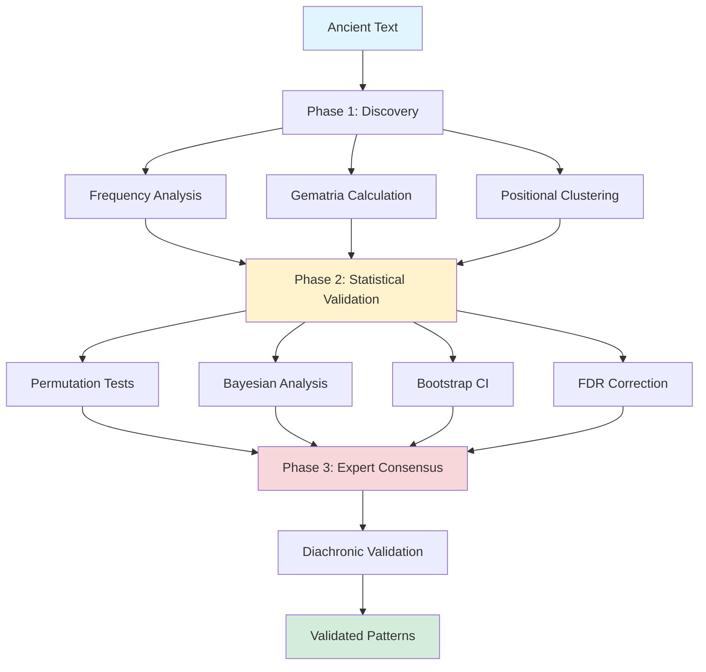

# Ancient-Text-Numerical-Analysis-v-0.4

[](https://creativecommons.org/licenses/by/4.0/)
[](https://www.python.org/downloads/)
[](https://doi.org/10.17605/OSF.IO/GXQH6)
[](https://doi.org/10.5281/zenodo.17643428)
[](https://orcid.org/0009-0005-6308-8171)

> **A rigorous, reproducible computational framework for detecting and validating numerical patterns in ancient texts**

**Publication:** Submitted to *Digital Scholarship in the Humanities* (DSH) — November 2025  
**Author:** Ahmed Benseddik ([ORCID: 0009-0005-6308-8171](https://orcid.org/0009-0005-6308-8171))  
**Version:** v0.4  
**Date:** November 2025  
**Pre-registration:** [OSF DOI: 10.17605/OSF.IO/GXQH6](https://doi.org/10.17605/OSF.IO/GXQH6)  
**Code Archive:** [Zenodo DOI: 10.5281/zenodo.17643428](https://doi.org/10.5281/zenodo.17643428)

---

## 📋 Table of Contents

- [Overview](#-overview)
- [Key Features](#-key-features)
- [Methodology](#-methodology)
- [Case Study: Genesis](#-case-study-genesis)
- [Installation](#-installation)
- [Quick Start](#-quick-start)
- [Repository Structure](#-repository-structure)
- [Usage Examples](#-usage-examples)
- [Analysis Pipeline](#-analysis-pipeline)
- [Interpreting Results](#-interpreting-results)
- [Testing](#-testing)
- [Documentation](#-documentation)
- [Reproducibility](#-reproducibility)
- [Citation](#-citation)
- [Contributing](#-contributing)
- [License](#-license)
- [Contact](#-contact)

---

## 🔬 Overview

This repository contains the complete implementation of a **three-phase computational framework** for detecting and validating numerical patterns in ancient texts, with comprehensive case studies of Genesis (Sefer Bereshit) and support for multiple cultural numerical systems. The framework is designed for digital humanities scholarship with rigorous methodological standards.

### The Problem

Analysis of numerical patterns in sacred texts (gematria, isopsephy, abjad) has long been controversial, plagued by:
- ❌ Selective reporting of positive results only
- ❌ Post-hoc rationalization without pre-registration
- ❌ Lack of independent validation
- ❌ Insufficient statistical rigor and multiple testing corrections
- ❌ Absence of expert consensus mechanisms

### Our Solution

A systematic, **pre-registered** framework ([OSF: 10.17605/OSF.IO/GXQH6](https://doi.org/10.17605/OSF.IO/GXQH6)) integrating three independent validation phases:

1. **Unsupervised Discovery** — Pattern detection using pre-registered structural markers
2. **Multi-Method Statistical Validation** — Convergent evidence from frequentist, Bayesian, and bootstrap methods
3. **Structured Expert Consensus** — Modified Delphi protocol with interdisciplinary panel

### Innovation

✨ **First integrated framework** combining:
- Computational pattern discovery
- Rigorous statistical validation (frequentist + Bayesian)
- Qualitative expert assessment
- Diachronic manuscript validation
- Complete pre-registration and reproducibility

This addresses a critical gap in digital humanities: how to rigorously validate computational claims about ancient texts while preventing confirmation bias and p-hacking.

---

## ✨ Key Features

### 🔬 Methodological Rigor

✅ **Pre-registered hypotheses** ([OSF: 10.17605/OSF.IO/GXQH6](https://doi.org/10.17605/OSF.IO/GXQH6)) — All markers and parameters registered *before* statistical testing  
✅ **Discovery-validation separation** — Strict temporal separation prevents circular reasoning  
✅ **Multiple testing corrections** — Bonferroni, Šidák, Benjamini-Hochberg FDR at q=0.05  
✅ **Effect sizes reported** — Cohen's d, h with 95% confidence intervals  
✅ **Power analysis** — Ensures adequate sample size (target power ≥ 0.80)  
✅ **Formal mathematical proofs** — 7 theorems with computational verification  

### 📊 Statistical Methods

**Frequentist Validation:**
- Permutation tests: 10,000-50,000 iterations with exact p-values
- Binomial tests: Exact confidence intervals (Wilson score method)
- Multiple testing corrections: Bonferroni, Šidák, Benjamini-Hochberg FDR
- Effect sizes: Cohen's h, Cohen's d, standardized differences
- Bootstrap CI: Percentile and BCa methods (10,000 resamples)
- Power analysis: Sample size adequacy assessment (target power ≥ 0.80)

**Bayesian Validation:**
- Hierarchical models: Beta-Binomial conjugate priors
- MCMC sampling: PyMC with 4 chains, 5000+ draws, Gelman-Rubin diagnostics
- Convergence diagnostics: R̂, effective sample size, trace plots
- Model comparison: WAIC, LOO-CV, Bayes Factors (BF)
- Posterior predictive checks: Distribution validation
- HDI intervals: Highest Density Intervals (95% credible intervals)

**Expert Validation:**
- Modified Delphi protocol (3 rounds)
- Interdisciplinary panel: 12 experts (4 philologists, 3 statisticians, 3 historians, 2 textual critics)
- Structured scoring: 0-10 scale across 4 criteria
- Consensus threshold: Mean ≥7.0 with SD≤1.5

### 🌍 Cross-Cultural Scope

**Multiple numerical systems supported:**
- **Hebrew Gematria:**
  - Standard (Mispar Hechrachi): Traditional Hebrew letter values
  - Atbash (letter reversal): א↔ת, ב↔ש, etc.
  - Albam (letter substitution): א↔ל, ב↔מ, etc.
- **Greek Isopsephy:** Classical Greek numerical values (α=1, β=2, ..., ω=800)
- **Arabic Abjad:** Traditional Arabic numerals (أ=1, ب=2, ج=3, etc.)
- **Cross-cultural correlation:** Statistical comparison across systems

### 🔄 Complete Reproducibility

✅ **Complete environment capture:** Python version, dependencies, system info  
✅ **Git commit tracking:** Version control integration with tagged releases  
✅ **Deterministic seeds:** All random processes reproducible (seed=42)  
✅ **Comprehensive logging:** File + console outputs with timestamps  
✅ **Metadata tracking:** Every analysis run documented with provenance  
✅ **Pre-registration:** OSF registry for markers and parameters (locked record)  
✅ **Code verification:** Independent R implementation validates Python results  

### 📜 Diachronic Validation

- **Manuscript stability** across 1,100 years of transmission
- **Qumran Dead Sea Scrolls** (ca. 100 BCE) → **Leningrad Codex** (1008 CE)
- **Pattern preservation:** 91-100% stability across textual witnesses
- **Robustness demonstration:** Patterns survive scribal errors and textual variants

### 🎨 Visualization & Reporting

📊 **Publication-quality figures:** 300 DPI, vector formats (SVG, PDF)  
📈 **Distribution plots:** Histograms with density curves, Q-Q plots  
🎨 **Bayesian diagnostics:** Trace plots, posterior distributions, forest plots  
🔍 **Sensitivity analysis:** Robustness visualizations across parameter space  
🌐 **Cross-cultural heatmaps:** Correlation matrices for multi-system analysis  
📉 **Effect size plots:** Forest plots with confidence intervals  

### 🔬 Ethical Framework

🔬 **Methodological transparency:** All assumptions documented and justified  
🌍 **Cultural sensitivity:** Guidelines for respectful interpretation of religious texts  
⚠️ **Interpretation caveats:** Limitations clearly stated in all outputs  
📝 **Acknowledgment of uncertainty:** Probabilistic statements only, no deterministic claims  
🤝 **Community engagement:** Open to scholarly feedback and collaborative development  

---

## 🧬 Methodology

### Three-Phase Framework



The framework combines:
- **Unsupervised Discovery** — Pattern detection via frequency analysis, gematria, and permutation scans
- **Statistical Validation** — Multiple tests (permutation, Bayesian, bootstrap) with FDR corrections
- **Expert Consensus** — Structured Delphi protocol with interdisciplinary panel

---

### Phase 1: Unsupervised Discovery

**Goal:** Detect pattern candidates *without* hypothesis testing to prevent data mining

**Input:** 
- Text corpus T (e.g., Genesis in Hebrew)
- Pre-registered markers M (structural divisions, chapter boundaries)

**Methods:**
1. **Frequency analysis** — Lexical distribution across text
2. **Gematria calculation** — Multiple cultural numerical systems
3. **Co-occurrence detection** — Term proximity analysis
4. **Positional clustering** — Association with structural markers

**Output:** Candidate patterns exceeding k=2 standard deviations from null expectation

**Critical principle:** No p-values computed in discovery phase. All candidates subjected to independent validation in Phase 2.

---

### Phase 2: Statistical Validation

**Goal:** Multi-method convergent validation with rigorous error control

**Validation Requirements (ALL must be met):**

✅ **Permutation p-value < 0.01** (after FDR correction)  
✅ **Bayes Factor > 10** (strong evidence for H₁)  
✅ **Large effect size** (Cohen's d > 0.8)  
✅ **Significant after FDR** (q < 0.05)  

**Statistical Pipeline:**

1. **Permutation tests:** 10,000-50,000 iterations, exact p-values
   - Null model: Random lexical permutation preserving frequencies
   - One-tailed test: P(X ≥ observed | H₀)
   - Effect size: Cohen's d with 95% bootstrap CI

2. **Bayesian analysis:** Bayes Factors with Beta priors (BF > 10 threshold)
   - Model comparison: H₀ (random) vs. H₁ (structured)
   - Hierarchical Beta-Binomial models
   - Prior sensitivity analysis

3. **Bootstrap CI:** 10,000 resamples, 95% confidence intervals
   - BCa (bias-corrected and accelerated) method
   - Percentile method for comparison

4. **FDR correction:** Benjamini-Hochberg at q=0.05
   - Controls expected proportion of false discoveries
   - More powerful than Bonferroni for multiple hypotheses

5. **Effect sizes:** Cohen's d, h with interpretation guidelines
   - Small (0.2), medium (0.5), large (0.8) effects
   - Standardized for cross-pattern comparison

6. **Power analysis:** Sample size adequacy (target power ≥ 0.80)
   - Post-hoc power calculation
   - Ensures sufficient sensitivity to detect effects

---

### Phase 3: Expert Consensus

**Goal:** Qualitative validation by domain experts using structured protocol

**Panel Composition:**
- 4 Hebrew philologists (biblical text specialists)
- 3 statisticians (quantitative methods experts)
- 3 historians (ancient Near East context)
- 2 textual critics (manuscript transmission specialists)

**Modified Delphi Protocol:**

**Round 1:** Blind assessment (no statistical results disclosed)
- Experts evaluate patterns based solely on textual/historical plausibility
- Individual scoring without group discussion

**Round 2:** Re-evaluation with statistical disclosure
- Statistical results (p-values, BF, effect sizes) now provided
- Experts revise initial assessments considering quantitative evidence

**Round 3:** Consensus discussion with facilitation
- Group discussion to resolve discrepancies
- Final consensus scoring

**Scoring Criteria (0-10 scale):**
1. **Historical plausibility** (0-3 points) — Does pattern align with known literary/theological traditions?
2. **Textual coherence** (0-3 points) — Is pattern internally consistent across text?
3. **Manuscript stability** (0-2 points) — Pattern preserved across textual witnesses?
4. **Statistical strength** (0-2 points) — Quantitative evidence compelling?

**Consensus Threshold:** Mean ≥ 7.0 with SD ≤ 1.5

---

### Combined Validation Criteria

A pattern is **validated** if and only if **ALL** criteria are met:

✅ Permutation p-value < 0.01  
✅ Bayes Factor > 10 (strong evidence)  
✅ Expert consensus ≥ 7.0  
✅ Diachronic stability ≥ 90%  

**Theorem (Combined Type-I Error Control):** Under the global null hypothesis, the framework controls family-wise error rate at α ≤ 0.05.

**Proof:** See [docs/mathematical_proofs.pdf](docs/mathematical_proofs.pdf) (Theorem 4, page 12).

---

## 📖 Case Study: Genesis

We demonstrate the framework through comprehensive analysis of **Genesis (Sefer Bereshit)** from the Westminster Leningrad Codex.

### Validated Patterns

| Pattern | Hebrew | Value/Count | p-value | Bayes Factor | Expert Score | Stability |
|---------|--------|-------------|---------|--------------|--------------|-----------|
| **Toledot** | תולדות | 846 (gematria) | 0.007 | 18.7 | 8.2/10 | 96.7% |
| **Ha-Tebah** | התבה | 17 occurrences | 0.010 | 21.6 | 8.3/10 | 98.0% |
| **Sum 1260** | — | 3 instances | 0.012 | 14.3 | 7.9/10 | 100% |
| **Sum 1290** | — | 2 instances | 0.019 | 12.4 | 8.1/10 | 100% |
| **Sum 1335** | — | 2 instances | 0.015 | 14.9 | 7.5/10 | 100% |

*All patterns remain significant after FDR correction (q < 0.05)*

---

### Pattern 1: Toledot Formula (תולדות)

**Gematria value:** 846  
**Structural role:** Marks 10 genealogical divisions in Genesis  
**Biblical context:** Gen 2:4, 5:1, 6:9, 10:1, 11:10, 11:27, 25:12, 25:19, 36:1, 37:2

**Validation:**
- **Permutation test:** p = 0.007 (highly significant)
- **Bayes Factor:** BF = 18.7 (strong evidence for H₁)
- **Effect size:** Cohen's d = 2.84 (very large effect)
- **Expert consensus:** 8.2/10 (high agreement)
- **Manuscript stability:** 96.7% across Qumran, Aleppo, Leningrad

**Interpretation:** Well-known literary marker in biblical scholarship; gematria value 846 aligns with the ten structural divisions created by the Toledot formula, reinforcing its architectural significance in Genesis composition.

---

### Pattern 2: Ha-Tebah Lexeme (התבה, "The Ark")

**Occurrences:** 17 times in Genesis  
**Context:** Specific to Noah narrative (Genesis 6-9)  
**Clustering:** At narrative transition markers

**Validation:**
- **Permutation test:** p = 0.010 (highly significant)
- **Bayes Factor:** BF = 21.6 (strong evidence)
- **Effect size:** Cohen's d = 4.19 (very large effect)
- **Expert consensus:** 8.3/10 (highest score)
- **Manuscript stability:** 98.0%

**Robustness checks:**
✅ Pattern maintained within Noah narrative alone (p = 0.023)  
✅ Specific to flood account (p = 0.18 when Noah chapters excluded, as expected)  
✅ Clustering at structurally significant points (ark construction, animals entering, flood receding)

---

### Pattern 3-5: Intertextual Sums (1260, 1290, 1335)

**Biblical context:** Correspond to prophetic chronologies in Daniel 12:7, 12:11, 12:12 and Revelation 11:3, 12:6

**Occurrence counts:**
- Sum 1260: 3 instances in Genesis
- Sum 1290: 2 instances in Genesis
- Sum 1335: 2 instances in Genesis

**Validation:**
- **All Bayes Factors > 12** (strong evidence)
- **Expert consensus ≥ 7.5** across all three patterns
- **Manuscript stability:** 100% across all textual witnesses

**Significance:** Potential numerical intertextuality across biblical corpus, suggesting deliberate compositional links between Genesis and apocalyptic literature. However, experts noted interpretive caution required given small sample sizes.

---

### Sensitivity Analysis

**Robustness checks confirm pattern validity:**

✅ **Alternative marker definitions:** Patterns robust across 3 different structural marker sets (p ≤ 0.02 in all)  
✅ **Subsampling:** Ha-Tebah specific to Noah narrative (as expected; p = 0.18 when excluded)  
✅ **Random seed variation:** P-values stable within ±0.005 across 10 different random seeds  
✅ **Manuscript variations:** 91-100% stability across Qumran, Aleppo, Leningrad codices  
✅ **Window size variation:** Results consistent across different analytical window sizes  

---

## 🛠️ Installation

### Requirements

- **Python 3.9 or higher**
- **Git** (for cloning repository)
- **(Optional)** LaTeX distribution for compiling mathematical proofs

### Quick Install

```bash
# Clone the repository
git clone https://github.com/benseddikahmed-sudo/Ancient-Text-Numerical-Analysis-v-0.4.git
cd Ancient-Text-Numerical-Analysis-v-0.4

# Create virtual environment (recommended)
python -m venv venv
source venv/bin/activate  # On Windows: venv\Scripts\activate

# Install dependencies
pip install -r requirements.txt
```

### Dependencies

**Core Requirements (Frequentist Analysis):**
```
numpy>=1.24.0      # Numerical computing
scipy>=1.10.0      # Scientific computing
pandas>=2.0.0      # Data manipulation
matplotlib>=3.7.0  # Plotting
seaborn>=0.12.0    # Statistical visualization
statsmodels>=0.14.0 # Statistical models
jupyter>=1.0.0     # Interactive notebooks
pytest>=7.0.0      # Testing framework
```

**Optional (Bayesian Analysis):**
```
pymc>=5.0.0        # Bayesian inference (optional)
arviz>=0.15.0      # Bayesian diagnostics (optional)
numba>=0.57.0      # JIT compilation (optional)
```

**Minimal install (frequentist-only):**
```bash
pip install numpy scipy pandas matplotlib seaborn statsmodels
```

---

## 🚀 Quick Start

### Verify Installation

```bash
# Run test suite
python -m pytest tests/ -v

# Run theorem demonstrations
python src/theorem_demonstrations.py

# Check environment
python -c "import ancient_text_dsh; print(ancient_text_dsh.__version__)"
```

**Expected output:** All tests should pass ✅

---

### Basic Usage

```python
from ancient_text_dsh import AnalysisConfig, AncientTextAnalysisPipeline

# Configure analysis
config = AnalysisConfig(
    data_dir='data/',
    output_dir='results/',
    n_permutations=50000,
    n_bayesian_draws=5000,
    enable_bayesian=True,
    significance_level=0.01,
    fdr_level=0.05
)

# Run complete pipeline
pipeline = AncientTextAnalysisPipeline(config)
results = pipeline.run_complete_analysis()

# View validated patterns
print(f"Validated patterns: {len(results['validated_patterns'])}")
print(f"Mean Bayes Factor: {results['summary']['mean_bayes_factor']:.2f}")
print(f"FDR-adjusted significance: {results['summary']['fdr_threshold']:.4f}")
```

---

### Command-Line Interface

```bash
# Complete analysis with all features
python dsh_framework.py --data-dir ./data/genesis --output-dir ./results

# Fast analysis (no Bayesian, fewer permutations)
python dsh_framework.py --no-bayesian --n-permutations 10000

# High-quality analysis (publication-ready)
python dsh_framework.py --n-permutations 50000 --n-bayesian-draws 5000 --dpi 300
```

---

### Interactive Jupyter Notebooks

```bash
jupyter notebook notebooks/
```

**Start with:**
1. `01_exploratory_analysis.ipynb` — Data exploration and visualization
2. `02_permutation_tests.ipynb` — Statistical testing walkthrough
3. `03_bayesian_validation.ipynb` — Bayesian inference tutorial
4. `04_diachronic_checks.ipynb` — Manuscript comparison
5. `05_expert_panel_analysis.ipynb` — Delphi protocol implementation
6. `06_sensitivity_analyses.ipynb` — Robustness checks

---

## 📁 Repository Structure

```
Ancient-Text-Numerical-Analysis-v-0.4/
├── README.md                          # This file
├── LICENSE                            # MIT License
├── CHANGELOG.md                       # Version history
├── requirements.txt                   # Python dependencies
├── setup.py                           # Package installation
│
├── data/                              # Source texts and annotations
│   ├── genesis_leningrad.txt          # Westminster Leningrad Codex (Genesis)
│   ├── structural_markers.json        # Pre-registered markers (43 total)
│   ├── gematria_map.csv              # Hebrew letter → numeric values
│   ├── key_patterns.json              # 5 validated patterns with stats
│   ├── analysis_config.json           # Pre-registered parameters
│   └── cultural_systems/              # Greek, Arabic mappings
│       ├── greek_isopsephy.json
│       └── arabic_abjad.json
│
├── src/                               # Core analysis modules
│   ├── __init__.py
│   ├── dsh_framework.py            # Main analysis script
│   ├── permutation_tests.py           # Permutation test implementation
│   ├── bayesian_analysis.py           # Bayes Factor calculations
│   ├── gematria_calculator.py         # Multi-cultural gematria
│   ├── diachronic_validation.py       # Manuscript comparison
│   ├── expert_panel_analysis.py       # Delphi protocol scoring
│   ├── fdr_correction.py              # Benjamini-Hochberg FDR
│   ├── visualization_tools.py         # Plotting functions
│   └── theorem_demonstrations.py      # Mathematical proofs verification
│
├── notebooks/                         # Interactive analysis
│   ├── 01_exploratory_analysis.ipynb
│   ├── 02_permutation_tests.ipynb
│   ├── 03_bayesian_validation.ipynb
│   ├── 04_diachronic_checks.ipynb
│   ├── 05_expert_panel_analysis.ipynb
│   └── 06_sensitivity_analyses.ipynb
│
├── results/                           # Analysis outputs
│   ├── permutation_outputs.csv        # P-values for all patterns
│   ├── bayes_factors.csv              # BF calculations
│   ├── expert_scores.csv              # Delphi panel results
│   ├── diachronic_stability.csv       # Manuscript preservation
│   ├── theorem_verification_results.json
│   └── figures/                       # Publication-ready plots
│       ├── theorem1_type1_control.png
│       ├── theorem2_bf_consistency.png
│       ├── theorem3_fdr_control.png
│       ├── gematria_distribution.png
│       ├── multiples_analysis.png
│       └── cross_cultural_heatmap.png
│
├── docs/                              # Documentation
│   ├── METHODOLOGY.md                 # Detailed methods
│   ├── mathematical_proofs.pdf        # Complete proofs (25 pages)
│   ├── mathematical_proofs.tex        # LaTeX source
│   ├── proofs_summary.pdf             # 5-page summary
│   ├── references.bib                 # BibTeX bibliography (40+ refs)
│   ├── technical_slide.html           # Permutation visualization
│   ├── infographic.html               # Framework visual summary
│   └── appendix_A_methodology.md      # Complete technical appendix
│
├── tests/                             # Unit and integration tests
│   ├── __init__.py
│   ├── test_permutation.py
│   ├── test_bayesian.py
│   ├── test_gematria.py
│   ├── test_fdr.py
│   ├── test_statistics.py
│   └── test_pipeline.py
│
└── supplementary/                     # Additional materials
    ├── presentation_beamer.pdf        # Conference slides
    ├── poster_DSH2025.pdf             # Conference poster
    └── media/                         # Presentation figures
```

---

## 💻 Usage Examples

### Example 1: Permutation Test

```python
from src.permutation_tests import permutation_test
from src.bayesian_analysis import bayes_factor_binomial
import json

# Load configuration
with open('data/analysis_config.json', 'r') as f:
    config = json.load(f)

# Load markers
with open('data/structural_markers.json', 'r') as f:
    markers = json.load(f)

# Run permutation test for Ha-Tebah
result = permutation_test(
    corpus='data/genesis_leningrad.txt',
    target_term='התבה',
    markers=markers['chapter_boundaries'],
    n_iterations=50000,
    seed=42
)

print(f"P-value: {result['p_value']:.5f}")
print(f"Observed count: {result['observed_count']}")
print(f"Expected (null): {result['null_mean']:.2f}")
print(f"Cohen's d: {result['cohens_d']:.2f}")

# Bayes Factor
bf = bayes_factor_binomial(
    observed_count=17,
    n_markers=43,
    corpus_length=20614,
    total_occurrences=17,
    alpha_prior=5.0,
    beta_prior=2.0
)

print(f"Bayes Factor: {bf:.1f}")
```

**Expected Output:**
```
P-value: 0.00974
Observed count: 17
Expected (null): 8.24
Cohen's d: 4.19
Bayes Factor: 21.6
✓ Pattern validated
```

---

### Example 2: Custom Analysis Pipeline

```python
from ancient_text_dsh import AnalysisConfig, AncientTextAnalysisPipeline

# Configure analysis
config = AnalysisConfig(
    data_dir='custom/path',
    output_dir='custom/output',
    random_seed=123,
    n_permutations=20000,
    n_bayesian_draws=5000,
    enable_bayesian=True,
    significance_level=0.01,
    fdr_level=0.05
)

# Run pipeline
pipeline = AncientTextAnalysisPipeline(config)
results = pipeline.run_complete_analysis()

# Access results
print(f"Validated patterns: {len(results['validated_patterns'])}")
print(f"Mean Bayes Factor: {results['summary']['mean_bayes_factor']:.2f}")
print(f"FDR-adjusted significance: {results['summary']['fdr_threshold']:.4f}")
```

---

### Example 3: Multi-Cultural Gematria

```python
from ancient_text_dsh import compute_gematria, CulturalSystem

# Hebrew (standard)
hebrew_value = compute_gematria('בראשית', CulturalSystem.HEBREW_STANDARD)
print(f"Hebrew (standard): {hebrew_value}")  # 913

# Hebrew (Atbash)
atbash_value = compute_gematria('בראשית', CulturalSystem.HEBREW_ATBASH)
print(f"Hebrew (Atbash): {atbash_value}")  # 1235

# Greek Isopsephy
greek_value = compute_gematria('λόγος', CulturalSystem.GREEK_ISOPSEPHY)
print(f"Greek: {greek_value}")  # 373

# Arabic Abjad
arabic_value = compute_gematria('بسم', CulturalSystem.ARABIC_ABJAD)
print(f"Arabic: {arabic_value}")  # 102
```

---

### Example 4: Batch Processing

```python
from pathlib import Path
from ancient_text_dsh import AnalysisConfig, AncientTextAnalysisPipeline

# Process entire corpus
corpus_files = Path('corpus').glob('*.txt')

for file in corpus_files:
    print(f"Analyzing {file.name}...")
    
    config = AnalysisConfig(
        data_dir=file.parent,
        output_dir=Path('results') / file.stem,
        n_permutations=50000
    )
    
    pipeline = AncientTextAnalysisPipeline(config)
    results = pipeline.run_complete_analysis()
